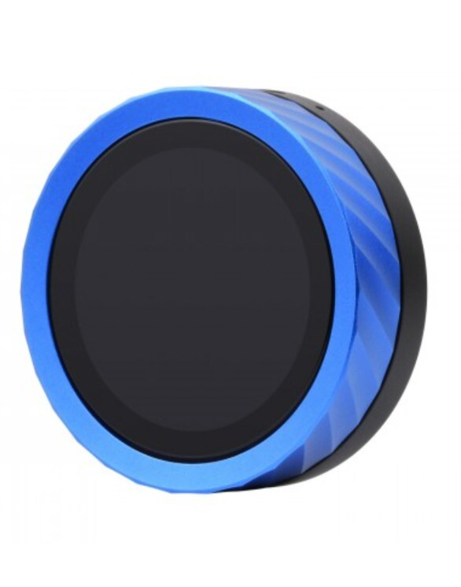
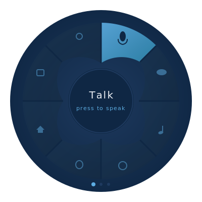

# ESP32 Voice Hub

A desktop voice assistant built on the Waveshare ESP32-S3-Knob-Touch-LCD-1.8 — featuring a radial wedge menu UI, push-to-talk voice interaction, and a blue mono design language.

<p align="center">
  
</p>



## Features

- 🎤 **Push-to-talk voice assistant** — Whisper STT → AI → TTS
- 🎛️ **Radial menu navigation** — rotary encoder + touch gestures
- 🔵 **Blue Mono UI** — deep navy background, cyan accents, matches hardware bezel
- 🔊 **External speaker output** — 3.5mm DAC with PCM5101A
- 📳 **Haptic feedback** — DRV2605 vibration motor
- 🖨️ **3D printable enclosure** — custom stand/dock designs

## Tech Stack

| Layer | Technology |
|-------|------------|
| **Framework** | Arduino + ESP-IDF |
| **UI Library** | [LVGL](https://lvgl.io/) v8/v9 |
| **Display Driver** | ST77916 (QSPI) via esp_lcd |
| **Touch Driver** | CST816 (I2C) |
| **Build System** | PlatformIO |
| **IDE** | VS Code + PlatformIO extension |

### Why Arduino/C++ over MicroPython?

The ST77916 display uses **QSPI** (Quad SPI), which isn't supported in standard MicroPython. While custom firmware could be built, Arduino/LVGL provides:
- Out-of-the-box QSPI display support
- Better performance for smooth UI animations
- First-class LVGL integration
- Existing reference implementations (see [Roon Knob](https://github.com/muness/roon-knob))

## Hardware

| Component | Details |
|-----------|---------|
| **Board** | [Waveshare ESP32-S3-Knob-Touch-LCD-1.8](https://www.waveshare.com/wiki/ESP32-S3-Knob-Touch-LCD-1.8) |
| **Display** | 1.8" round LCD, 360×360, ST77916 (QSPI) |
| **Touch** | CST816 capacitive (I2C) |
| **Audio Out** | PCM5101A DAC, 3.5mm jack |
| **Audio In** | Onboard digital microphone |
| **Input** | Rotary encoder with push button |
| **Haptics** | DRV2605 vibration motor |
| **MCU** | ESP32-S3R8 (8MB PSRAM, 16MB Flash) |

⚠️ **Note:** This board has dual MCUs. The ESP32-S3 handles the display/UI, while a secondary ESP32 handles Bluetooth audio. See [docs/hardware-notes.md](docs/hardware-notes.md) for flashing details.

## Getting Started

### Prerequisites

- [VS Code](https://code.visualstudio.com/)
- [PlatformIO extension](https://platformio.org/install/ide?install=vscode)
- USB-C cable

### Clone & Build

```bash
git clone https://github.com/mikehole/esp32-voice-hub.git
cd esp32-voice-hub/firmware/platformio

# Build
pio run

# Upload (device on COM4, adjust for your system)
pio run -t upload --upload-port COM4
```

### Monitor Serial Output

```bash
pio device monitor -p COM4 -b 115200
```

## Project Structure

```
esp32-voice-hub/
├── firmware/
│   └── platformio/     # Main firmware (Arduino + LVGL)
│       ├── src/        # Source code
│       ├── lib/        # Project-specific libraries
│       └── platformio.ini
├── assets/
│   ├── icons/          # SVG source icons
│   └── mockups/        # UI design mockups
├── enclosure/
│   └── stl/            # 3D printable parts
└── docs/
    ├── design.md       # UI design language
    └── hardware-notes.md  # Flashing & hardware details
```

## Design Language

**Blue Mono** — deep navy background (#0F2744), cyan selection accents (#5DADE2), 8-wedge Trivial Pursuit layout, designed to complement the blue aluminium bezel.

See [docs/design.md](docs/design.md) for full palette and guidelines.

## Roadmap

- [x] Hardware selection
- [x] UI design mockups
- [x] Hardware bring-up (flashing, USB detection)
- [ ] PlatformIO project setup
- [ ] Display driver (ST77916 QSPI)
- [ ] Touch driver (CST816 I2C)
- [ ] LVGL integration
- [ ] Radial wedge menu UI
- [ ] Encoder input handling
- [ ] Audio loopback test (mic → speaker)
- [ ] Voice assistant integration (WiFi → OpenClaw)
- [ ] 3D printed enclosure

## Resources

- [Waveshare Wiki](https://www.waveshare.com/wiki/ESP32-S3-Knob-Touch-LCD-1.8) — Official documentation
- [Roon Knob](https://github.com/muness/roon-knob) — Reference project using same hardware
- [ESP32_Display_Panel](https://github.com/esp-arduino-libs/ESP32_Display_Panel) — Espressif's display library
- [LVGL Documentation](https://docs.lvgl.io/) — UI library docs

## License

MIT — see [LICENSE](LICENSE)

## Contributing

This is an early-stage personal project, but PRs and ideas are welcome!
