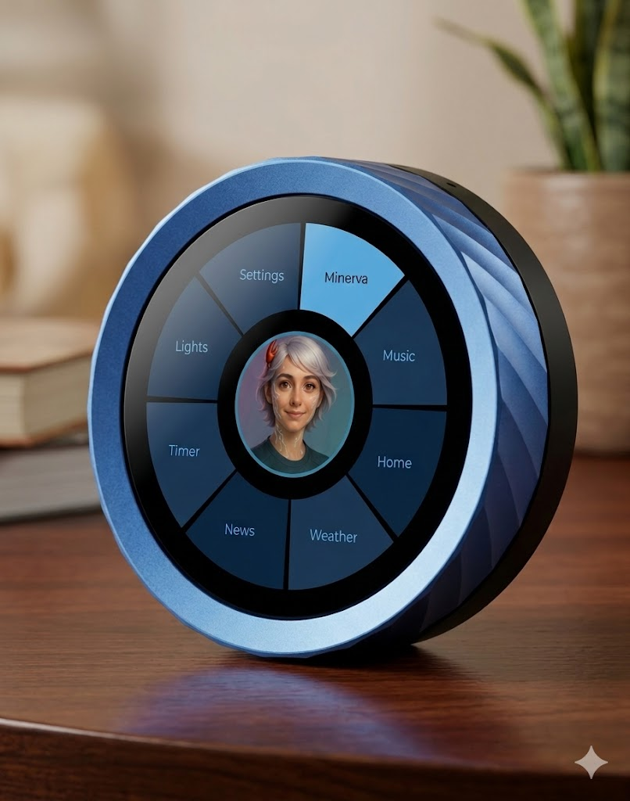
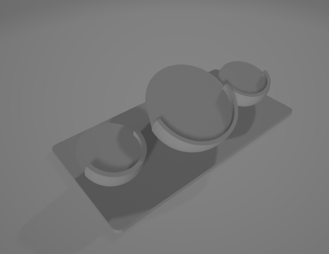
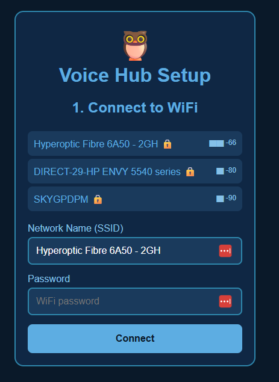
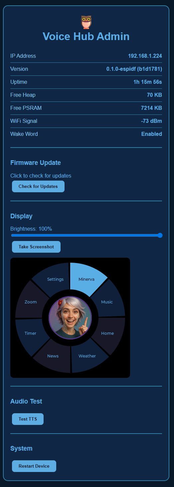

# ESP32 Voice Hub

A desktop voice assistant built on the Waveshare ESP32-S3-Knob-Touch-LCD-1.8 — featuring expressive avatar states, radial wedge menu UI, and integration with any OpenAI-compatible API (OpenClaw, OpenAI, Ollama, LM Studio, OpenRouter, etc.).

<p align="center">
  
</p>

## ✨ Features

- 🎤 **Wake word + tap-to-talk** — Say "Computer" or tap to start, Whisper STT → AI → TTS
- 🦀 **Expressive avatar** — Minerva shows emotions: idle, listening, thinking, speaking, connecting, notification
- 🔔 **Push notifications** — `/api/notify` endpoint for external alerts with tap-to-acknowledge
- 🎛️ **Radial menu navigation** — rotary encoder + touch gestures
- 🔵 **Blue Mono UI** — deep navy background, cyan accents, matches hardware bezel
- 🌐 **Web admin panel** — configure WiFi, API keys, test audio
- 🔄 **OTA updates** — over-the-air firmware updates via HTTP
- 🔊 **Audio output** — onboard speaker + 3.5mm DAC

> ⚠️ **Current Status:** Only the **Minerva** (voice assistant) wedge is functional. Other wedges (Music, Weather, Home, etc.) are UI placeholders for future development.

## 🎭 Avatar States

Minerva (the assistant) has expressive avatar states that change based on what she's doing:

| State | Avatar | Ring Animation |
|-------|--------|----------------|
| **Idle** | Neutral expression | — |
| **Connecting** | ⚡ Electrocuted! | 🔵 Blue spinning |
| **Recording** | 👂 Hand to ear, listening | 🔴 Red pulsing |
| **Thinking** | 🤔 Contemplative | — |
| **Speaking** | ✨ Excited | 💠 Cyan pulsing |
| **Notification** | 👆 Tapping screen | 💜 Purple pulsing |

Avatar images are embedded in firmware (~200KB for 8 images).

## 🛠️ Tech Stack

| Layer | Technology |
|-------|------------|
| **Framework** | ESP-IDF 5.5 |
| **UI Library** | [LVGL](https://lvgl.io/) v8 |
| **Display Driver** | SH8601 (QSPI) via esp_lcd |
| **Touch Driver** | CST816 (I2C) |
| **Audio** | I2S PDM microphone + I2S DAC |
| **Wake Word** | ESP-SR ("Computer") |
| **AI Backend** | [OpenClaw](https://github.com/openclaw/openclaw) via WebSocket |

## 🔧 Hardware

| Component | Details |
|-----------|---------|
| **Board** | [Waveshare ESP32-S3-Knob-Touch-LCD-1.8](https://www.waveshare.com/wiki/ESP32-S3-Knob-Touch-LCD-1.8) |
| **Display** | 1.8" round AMOLED, 360×360, SH8601 (QSPI) |
| **Touch** | CST816 capacitive (I2C) |
| **Audio Out** | Onboard speaker + PCM5101A DAC (3.5mm) |
| **Audio In** | Onboard PDM digital microphone |
| **Input** | Rotary encoder with push button |
| **Storage** | SD card slot |
| **MCU** | ESP32-S3R8 (8MB PSRAM, 16MB Flash) |

### Additional Hardware

| Item | Notes |
|------|-------|
| **External Speakers** | [USB Mini Speakers with 3.5mm jack](https://www.amazon.co.uk/dp/B0FWBCTH72) — USB powered, connects to DAC output |
| **3D Printed Stand** | [`enclosure/stl/desk_hub_v2.stl`](enclosure/stl/desk_hub_v2.stl) — holds device + speaker |

<p align="center">
  
</p>

## 🚀 Getting Started

### Prerequisites

- [ESP-IDF 5.5+](https://docs.espressif.com/projects/esp-idf/en/latest/esp32s3/get-started/)
- USB-C cable
- OpenClaw instance (or compatible WebSocket voice server)

### Clone & Build

```bash
git clone https://github.com/mikehole/esp32-voice-hub.git
cd esp32-voice-hub/firmware/espidf

# Configure ESP-IDF environment
. $IDF_PATH/export.sh

# Build
idf.py build

# Flash (first time - requires USB)
idf.py -p /dev/ttyUSB0 flash
```

### First Boot

1. Device creates WiFi AP: `ESP32-Voice-Hub`
2. Connect and the captive portal appears automatically
3. Select your network and enter credentials
4. Configure OpenClaw endpoint in the admin panel

<p align="center">
  
</p>

### Using the Device

1. Say **"Computer"** to wake, or **tap center** to start recording
2. Speak your message (she cups her ear to listen)
3. Release or stop speaking — silence detection ends recording
4. Watch her **think** (contemplative pose)
5. Hear her **respond** (excited pose with cyan pulsing ring)

### OTA Updates

After initial USB flash, update over-the-air:

```bash
curl -X POST http://<device-ip>/api/ota/upload \
  --data-binary @build/esp32_voice_hub.bin
```

## 📁 Project Structure

```
esp32-voice-hub/
├── firmware/
│   └── espidf/
│       ├── main/
│       │   ├── main.c              # Application entry
│       │   ├── voice_client.c      # WebSocket + touch handling
│       │   ├── wakeword.c          # ESP-SR wake word detection
│       │   ├── audio.c             # I2S mic + DAC playback
│       │   ├── display.c           # LVGL display management
│       │   ├── wedge_ui.c          # Radial menu UI
│       │   ├── notification.c      # Push notification system
│       │   ├── web_server.c        # HTTP API + admin panel
│       │   ├── wifi_manager.c      # WiFi + captive portal
│       │   ├── ota_update.c        # OTA firmware updates
│       │   └── avatar_images.h     # Embedded avatar images (RGB565)
│       ├── sdkconfig.defaults
│       └── CMakeLists.txt
├── avatar-poses/                    # Source avatar images
│   └── mike-picks/cropped/          # Processed 130x130 images
├── assets/                          # Product photos & mockups
├── docs/
│   ├── design.md                    # UI design language
│   └── hardware-notes.md            # Hardware details
└── enclosure/
    └── stl/                         # 3D printable parts
```

## 🎨 Design Language

**Blue Mono** — deep navy background (#0F2744), cyan accents (#5DADE2), 8-wedge Trivial Pursuit layout.

The avatar's circuit traces glow cyan to match the UI accent color.

## 🏗️ Architecture

```
┌─────────────────────────────────────────────────────────────┐
│                        Main Loop                             │
│  ┌─────────────┐  ┌─────────────┐  ┌─────────────────────┐  │
│  │ Touch/Encoder│  │ LVGL UI     │  │ Notification Update │  │
│  └─────────────┘  └─────────────┘  └─────────────────────┘  │
└─────────────────────────────────────────────────────────────┘
                              │
┌─────────────────────────────────────────────────────────────┐
│                    Background Tasks                          │
│  ┌─────────────┐  ┌─────────────┐  ┌─────────────────────┐  │
│  │ Wake Word   │  │ Recording   │  │ WebSocket Client    │  │
│  │ (ESP-SR)    │  │ Task        │  │ (OpenClaw)          │  │
│  └─────────────┘  └─────────────┘  └─────────────────────┘  │
└─────────────────────────────────────────────────────────────┘
```

FreeRTOS tasks handle wake word detection and audio recording on separate cores. LVGL runs in its own task with mutex protection.

## ⚙️ Configuration

Via web admin panel (`http://<device-ip>/admin`) or NVS storage:

<p align="center">
  
</p>

| Setting | Description |
|---------|-------------|
| WiFi SSID/Password | Network credentials |
| OpenClaw Endpoint | WebSocket URL (e.g., `ws://192.168.1.100:8765`) |
| Display Brightness | 0-100% with live preview |
| Wake Word | Enable/disable "Computer" detection |

The admin panel also shows:
- System status (IP, uptime, heap, PSRAM, WiFi signal)
- Firmware version and OTA controls
- Audio recording test tools

## 📡 API Endpoints

The device exposes REST endpoints for external integration:

| Endpoint | Method | Description |
|----------|--------|-------------|
| `/api/status` | GET | Device status JSON |
| `/api/notify` | POST | Queue notification (tap to acknowledge + TTS) |
| `/api/notify-audio` | POST | Queue pre-rendered audio notification |
| `/api/play` | POST | Play raw PCM audio immediately |
| `/api/brightness` | GET | Set brightness (`?v=0-100`) |
| `/api/screenshot` | GET | Capture display as BMP |
| `/api/ota/upload` | POST | Upload firmware binary |
| `/api/ota/check` | GET | Check for updates (GitHub releases) |
| `/api/restart` | GET | Restart device |

### Push Notifications

Send a notification that waits for user acknowledgment:

```bash
curl -X POST http://<device-ip>/api/notify \
  -d "Hey Mike, you have a calendar event in 30 minutes"
```

**Flow:**
1. Device shows "tapping screen" avatar with purple pulsing ring
2. Attention chime plays every 3 seconds
3. User taps center to acknowledge
4. Device speaks the announcement via TTS
5. Returns to idle state

Add `?silent=1` to skip the attention chime.

For pre-rendered audio notifications:
```bash
curl -X POST "http://<device-ip>/api/notify-audio?rate=24000" \
  --data-binary @notification.pcm
```

## 🗺️ Roadmap

### Done ✅
- [x] Voice assistant with wake word ("Computer") + tap-to-talk
- [x] Expressive avatar states (idle, listening, thinking, speaking, notification)
- [x] Push notifications with tap-to-acknowledge
- [x] Web admin panel & WiFi captive portal
- [x] Hierarchical menus (Settings submenu)
- [x] Rotary encoder navigation
- [x] OTA firmware updates
- [x] Screenshot API
- [x] GitHub Actions CI
- [x] 3D printable desk stand

### Planned 🚧
- [ ] **Web flasher** — Browser-based flashing via ESP Web Tools
- [ ] **Bluetooth HID** — Device pairs with PC as keyboard/media controller
- [ ] **Zoom/Meeting wedge** — Mute, camera, raise hand (BT HID shortcuts)
- [ ] **Music wedge** — Play/pause, next/prev, volume (BT HID media keys)
- [ ] **Weather wedge** — Current conditions & forecast
- [ ] **Home wedge** — Home Assistant integration
- [ ] **Timer wedge** — Countdown timers & alarms
- [ ] **Themed avatars** — Unique Minerva for each wedge

## 📝 License

MIT — see [LICENSE](LICENSE)

## 🙏 Acknowledgments

- [Waveshare](https://www.waveshare.com/) for the excellent hardware
- [LVGL](https://lvgl.io/) for the UI library
- [OpenClaw](https://github.com/openclaw/openclaw) for the AI gateway
- [Espressif](https://github.com/espressif) for ESP-IDF and ESP-SR
